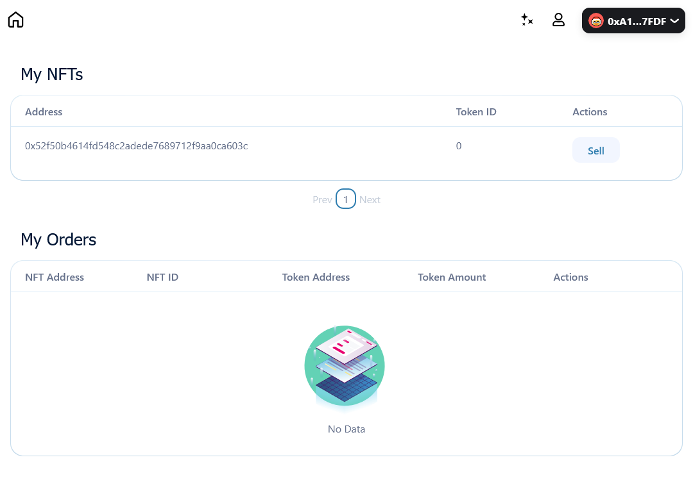

# NFT Marketplace 🛒

[](https://github.com/miguelleonmarti/nft-marketplace-task/actions/workflows/hardhat_tests.yml) 

Marketplace to sell and buy NFTs (ERC721) with ERC20 tokens through the [0x v4 protocol].



## Get started

In order to run the project locally follow the next steps:

### Hardhat

- Install dependencies

```sh
cd hardhat && npm install
```

- To compile the contracts and generate typechain typings for compiled contracts:

```sh
npx hardhat clean && npx hardhat compile && npx hardhat typechain
```

- (Optional) You need to copy and paste the Typechain typings generated to the frontend directory so the Dapp works. There is already a script for that:

```sh
npm run typechain
```

- Run tests:

```sh
npx hardhat test
```

### Frontend

In order to run the project locally follow the next steps:

- Install dependencies

```sh
cd frontend && npm install
```

- Create and start the docker container with the PostgreSQL database:

```sh
docker compose up -d
```

- Create migrations from the Prisma schema, apply them to the database and generate artifacts:

```sh
npx prisma migrate dev --preview-feature
```

- Run the app:

```sh
npm run dev
```

## Features

- Users can **request new NFT tokens** to be minted, no restrictions here, anyone can request new NFT minting free-of-charge
- Users can **list their NFT token for sale for any price they want using the ERC-20 token**.
- Users can **list and review** all existing and yet not executed sell offers.
- Users can **accept** the existing sell order from some other user and purchase the NFT using ERC-20

## Details

- ERC-20 token standard using the [OpenZeppelin] implementation.
- ERC-721 token standard using the [Azuki] project implementation.

[0x v4 protocol]: https://docs.0x.org/nft-support/docs/introduction
[azuki]: https://github.com/chiru-labs/ERC721A
[openzeppelin]: https://docs.openzeppelin.com/contracts/4.x/erc20
